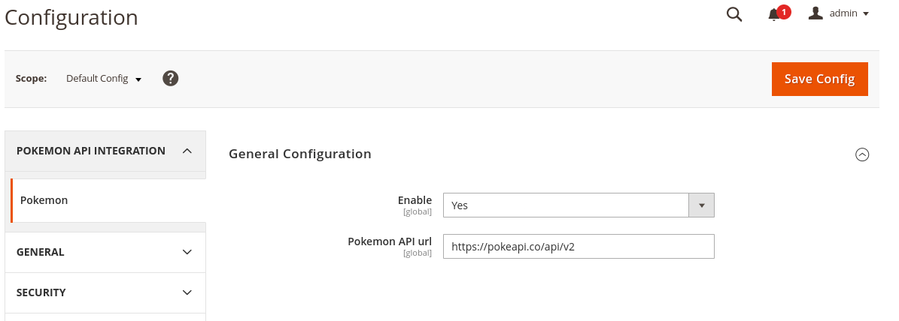
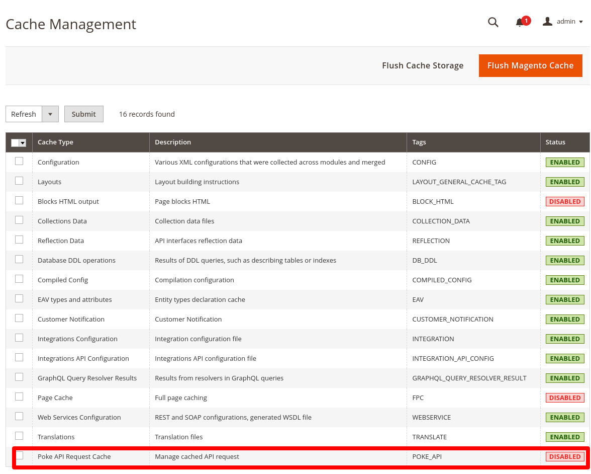
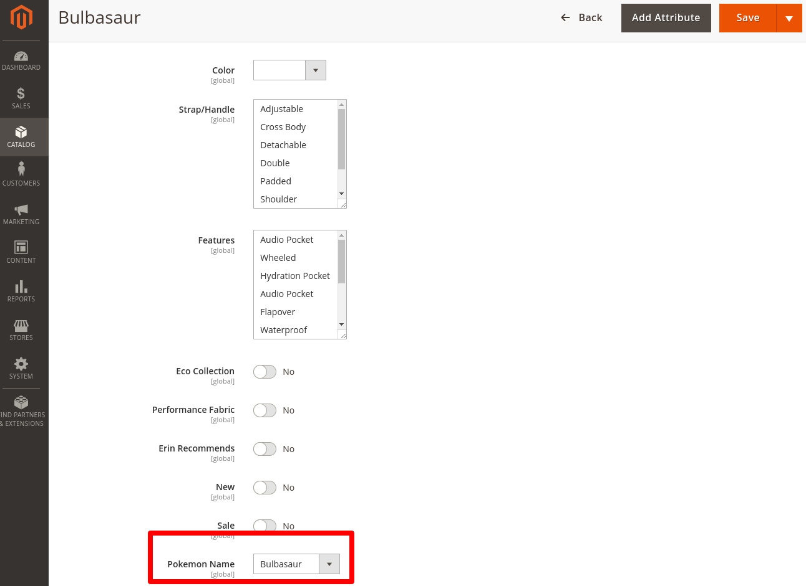
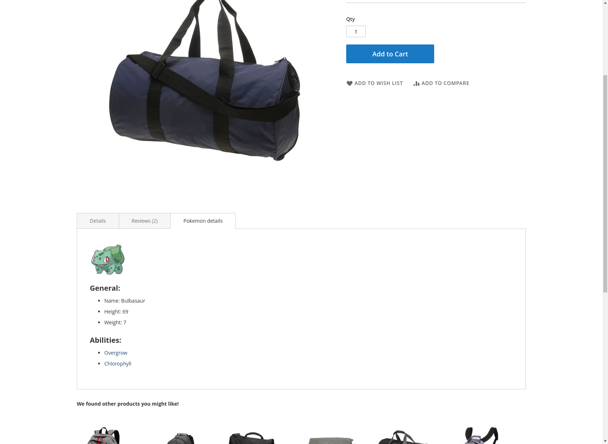

# Pokemon API integration with Magento 2 
### v 0.0.4


## Description:

This module provide an integration with PokeAPI and allows to link pokemon data with Magento2 products.

## Installations:

Module can be installed via composer:

``` composer require szymonborowski/pokemon ```

also Magento setup upgrade is nesesery 

``` bin/magento setup:upgrade ```

## Configuration

Module configuration is available in admin panel under Stores -> Configuration -> Pokemon API.
Module is configured and enable by default.


There is an option to enable/disable Poke API cache in admin cache management panel



Pokemon can by linked with product in product edit page.



## Progress

Data of Pokemon are available on product page.
Data are fetched from PokeAPI and stored in Magento cache.
Data are loaded dynamically after page load.



Product title is replaced with plugin. It should be done by via Ajax, using frontend component.

Unfortunately replacing data on listing page is not done yet.
